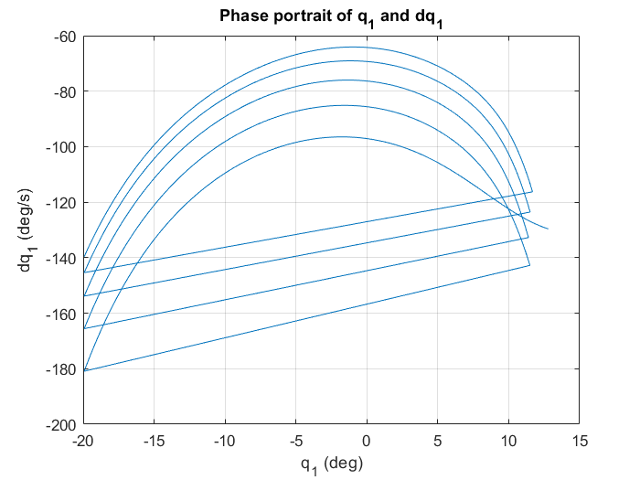

# Three-Link Biped — Hybrid Zero Dynamics Walking Control

A MATLAB implementation of feedback-linearizing, Hybrid Zero Dynamics (HZD) control for a planar, three-link (point-foot) bipedal walker. The pipeline symbolically derives the robot's equations of motion, the rigid-body impact map, and the feedback-linearizing controller; optimizes a walking gait parameterized by Bézier polynomials; then simulates and animates the resulting limit-cycle walking motion — both on the reduced zero-dynamics manifold and on the full 6-state hybrid dynamics.

<p align="center">
  
</p>

## Background

The robot is modeled as three rigid links connected at a hip: a **stance leg**, a **swing leg**, and a **torso**, each carrying a point mass, plus a concentrated hip mass. Walking is treated as a hybrid system:

- **Continuous (swing) phase** — the stance foot acts as a pivot and the robot evolves under the single-support Lagrangian dynamics `D(q)q̈ + C(q,q̇)q̇ + G(q) = Bu`.
- **Discrete (impact) event** — when the swing foot touches the ground, an instantaneous, perfectly-plastic impact map remaps the full state (leg roles swap: swing becomes stance).

A **virtual constraint** is imposed on the swing-leg and torso angles (`q2`, `q3`) as 4th-order Bézier polynomials of a gait-timing variable `s`, itself a normalized function of the stance-leg angle `q1`. Feedback linearization drives the outputs `h(x) = [q2, q3] − [b2(s), b3(s)]` to zero, restricting the closed-loop dynamics to a lower-dimensional invariant surface (the **zero dynamics**) parameterized purely by `(q1, q̇1)`. Gait parameters and Bézier coefficients are chosen via constrained optimization (`fmincon`) to produce a periodic, symmetric walking cycle while minimizing control effort.


## Requirements

- MATLAB (developed/tested on R2019+ era releases)
- **Symbolic Math Toolbox** — required by `generate_functions.m`
- **Optimization Toolbox** — required by `OptimizeClean.m` (`fmincon`)

No external packages or non-MATLAB dependencies are needed.

## Quick start

```matlab
set_path      % adds util/ and autogen/ to the MATLAB path
main          % runs the full pipeline end-to-end
```

`main.m` is the single entry point and walks through four stages, each individually toggleable via flags at the top of the script:

| Stage | Script | Flag | Purpose |
|---|---|---|---|
| 1 | `generate_functions.m` | `runGen` | Symbolically derives dynamics/impact/control terms and writes them to `autogen/`. Runs automatically the first time if `autogen/` is empty. |
| 2 | `OptimizeClean.m` | `runOpt` | Solves for pre-impact states and Bézier coefficients (`f`) that yield a periodic, cost-minimizing gait for a target step length. |
| 3 | `simZD2.m` | `runSimZ`, `bez` | Simulates the reduced zero dynamics `(q1, q̇1)` across several steps and plots the phase portrait (+ Bézier curves if `bez = 1`). |
| 4 | `sim_and_plot_full_dynamics.m` | `runSimF` | Simulates the full 6-state hybrid dynamics under the feedback-linearizing controller, then plots joint trajectories and animates the walk. |

Key optimization inputs, set in `main.m` before running `OptimizeClean`:

```matlab
stepLen = 0.7;              % desired step length [m]
theta   = acosd(stepLen/2); % half-interleg angle at impact
q1d     = -170;              % pre-impact stance-leg velocity direction [deg/s]
q3f     = 170;  q3df = 5;    % torso: final angle / velocity target [deg]
a3      = 5;    g3   = 155;  % initial guesses for 3rd Bézier coefficients
```

PD gains for the feedback-linearizing controller live in `func_feedback.m` (`kp1, kp2, kd1, kd2`) — tune there if the full-dynamics simulation diverges.

## Repository layout

```
main.m                          Entry point — orchestrates the full pipeline
set_path.m                       Adds util/ and autogen/ to the MATLAB path

generate_functions.m             Symbolic derivation of dynamics, impact map,
                                  feedback-linearization terms, zero dynamics
                                  (writes generated functions into autogen/)

OptimizeClean.m                   fmincon-based gait optimizer (periodicity +
                                  control-effort cost)

sim_zero_dynamics.m               Single-step ODE45 simulation of the zero
                                  dynamics, applying the impact map first
simZD2.m                          Multi-step zero-dynamics simulation + plots

func_full_dynamics.m               Full 6-state closed-loop dynamics (ODE45 RHS)
func_feedback.m                   Feedback-linearizing + PD controller
func_zero_dynamics.m              Reduced (q1, q̇1) dynamics (ODE45 RHS)
func_impact_map.m                  Rigid-body impact map (pre- → post-impact state)
func_compute_control_action.m      Open-loop control action along the zero
                                  dynamics manifold (used for cost evaluation)

sim_and_plot_full_dynamics.m       Runs the full-dynamics simulation for N
                                  steps, re-applying the impact map at each
                                  step transition
plot_trajectories.m                Joint angle/velocity + phase-portrait plots
animate_results.m                  Stick-figure animation of the walking gait
analyse_mobility.m                Compares saved gaits across torso mass/length
q1_min.m                           (currently empty/unused)

util/
  func_model_params.m              Physical parameters (masses, lengths, g)
  func_gait_timing.m                Gait-timing variable s(q1)
  bezier.m / d_ds_bezier.m          Bézier polynomial + derivative evaluation
  func_map_z_x.m                   Maps reduced state z=(q1,q̇1) to full state x
  write_symbolic_term_to_mfile.m    Codegen helper used by generate_functions.m

autogen/                          Auto-generated MATLAB functions (symbolic
                                  outputs of generate_functions.m) — safe to
                                  delete and regenerate

Final Plots/                      Saved result figures (Bézier curves, ZD
                                  phase portrait) referenced in reports
phase.png                          Phase-portrait figure shown above
```

## Model conventions

- Angles are measured **counter-clockwise positive**.
- `q1` — stance-leg angle, absolute, measured from the vertical (world) axis.
- `q2` — swing-leg angle, relative to the stance leg.
- `q3` — torso angle, relative to the stance leg.
- Bézier coefficients printed/plotted by `simZD2.m` are in **degrees**; internal dynamics use **radians**.
- `theta` (used to set the optimizer's initial guess) relates to step length by `step_length = 2*r*cos(theta)`, where `r` is leg length.


